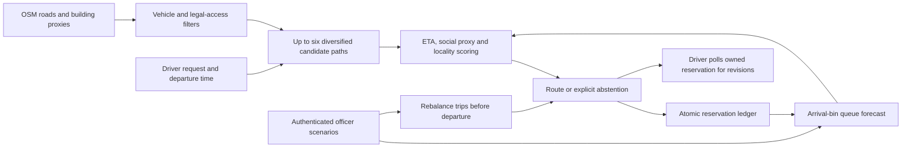

# Vehicle-aware anticipatory routing: implemented study

This guide describes the completed extension, its public inputs, executed experiments and internal paper draft. The manuscript and results contain the unsuccessful and inconclusive comparisons. It is not a validated city traffic intervention or an externally submission-ready A* contribution.

**Subsequent evidence:** [the completed SUMO study](SUMO_STUDY.md) adds 640 policy runs and 384,000 records. Original RoadFit is worse than static by 138.60 seconds [99.12, 179.01] in the independent microscopic comparison. The point-queue gains below are retained as model-specific findings; they do not transfer. See [the fixed SUMO protocol](SUMO_PROTOCOL.md) for source, reproduction and fidelity limits.

## Prior art and contribution boundary

Proactive load balancing before vehicles reach congestion already appears in [Pan et al., DCOSS 2012](https://doi.org/10.1109/DCOSS.2012.29). [Menelaou et al., IFAC 2018](https://doi.org/10.1016/j.ifacol.2018.07.077) study occupancy prediction with route reservations; [R3, VLDB 2014](https://www.vldb.org/2014/program/papers/demo/p1007-wang.pdf) is a route recommendation demo. [Valhalla](https://valhalla.github.io/valhalla/api/route/api-reference/) already supports truck dimensions and restrictions. A separate officer login is a useful interface, not evidence of an original algorithm.

Accepted data-driven ETA papers include [DeepTTE, AAAI 2018](https://ojs.aaai.org/index.php/AAAI/article/view/11877), [HetETA, KDD 2020](https://www.kdd.org/kdd2020/accepted-papers/view/heteta-heterogeneous-information-network-embedding-for-estimating-time-of-a.html), and [BusTr, KDD 2020](https://www.kdd.org/kdd2020/accepted-papers/view/bustr-predicting-bus-travel-times-from-real-time-traffic.html). They use substantial recorded data, explicit baselines and evaluation protocols; prediction alone does not prove that an officer intervention reduces delay. FutureLight is listed in the [VLDB 2026 program](https://vldb.org/2026/program.html), showing that anticipatory traffic control also extends to signals. This study does not support the claim that signals cannot help.

The implemented controller is a bounded candidate heuristic combining vehicle/access filters, arrival-bin queue forecasts, voluntary reservations and a locality budget. Novelty and superiority are not established. The subsequent SUMO study includes matched departure-policy adaptations of DSP/RkSP/EBkSP and reproduces the published entropy example; it does not reproduce their complete periodic rerouting systems.

## Inputs and provenance

| Input | Acquired evidence | Limitations |
|---|---|---|
| Expanded Bengaluru OSM map | 198,984 nodes; 490,185 directed edges; bbox west/south/east/north = 77.48/12.82/77.80/13.10 | Not all Bengaluru administrative territory; unvalidated tags; drive/service topology omits some bicycle-only routes |
| OSM buildings | 750,484 distinct mapped way footprints; centroids counted within 50 m of each edge midpoint | Incomplete mapping; relations omitted; footprint count does not measure households, residents, parked vehicles or demand |
| Road tags | Width on 1,546 edges; height on 765; lanes on 29,104; speed on 10,665; weight on zero | Missingness is severe; full observed constraint coverage is zero |
| TNTP | Pinned Sioux Falls, Anaheim and Chicago-Sketch networks and OD tables | Scaled synthetic departures, capacities, shocks and vehicle mix; Sioux Falls is a debugging network; Chicago OD is aggregated |
| DeepTTE author sample | 18,000 training/calibration and 1,400 later-date recorded test trips | Chengdu rather than Bengaluru; this tabular baseline is not a reproduction of DeepTTE or HetETA |
| Satellite view | Optional Esri imagery with attribution | Display only; no road-width or vehicle-count measurements extracted |

All source versions, retrieval times and SHA-256 values are saved under `data/public`. Public OSM data is attributed to OpenStreetMap contributors under ODbL. Other dataset terms remain those of the linked source repositories. No aerial pixels have been converted into invented clearance or traffic labels.

## Architecture and actual behavior



Vehicle classes have declared width, height, mass, turning-radius, speed and PCU assumptions. Motorcycles can use eligible small streets, but do not automatically use cycleways. Bicycles cannot automatically use motorways or steps. Trucks exclude through-routing on residential/living/service roads; nearby terminal access still requires geometry and legal-access checks. Hatchbacks can combine eligible road categories. Conditional restrictions, turn-restriction relations and swept-path turning geometry are not implemented. Bicycle support is incomplete on this drive graph.

The queue model uses 120-second entry bins and assumed capacity remaining after background flow, with a five-percent service floor and initially zero backlog. It scores every edge at predicted arrival. The external-delay term is a proxy, not an exact system optimum. Local-street admission rejects excessive modeled entry rates; a soft building-density penalty adds a locality cost. The selected candidate must be within 1.25 times the fastest admitted candidate's predicted ETA. This bound applies only to the generated candidates and current model.

Previews do not add load. Reservations commit under a shared lock and have opaque ownership tokens. Cancellation and expiry release entries. The officer console shows aggregated future bins without exposing those tokens; manual forecasts and closures require authentication. Rebalancing removes and replans up to twenty future departures per API call (ten in the interface), preserving ownership tokens. Started trips are skipped because GPS progress is unavailable. Driver views poll for revisions every ten seconds. In-memory state resets on restart. This is a local scenario system, not a deployment with verified telemetry or compliance.

## Results and ablations

The primary traffic score is mean `min(actual trip duration, 3600 seconds)`, with 3600 for an unassigned request. Actual conditional durations, assignment and one-hour throughput are reported separately. Candidate pools are frozen, and an independent FIFO point-queue executor perturbs capacities and background service. Correlated conditions sharing network and seed stay together in the analysis bootstrap. These are exploratory intervals, not preregistered confirmatory tests.

| Cohort | Episodes / per-policy records | Balanced minus static capped delay | Mean scenario-relative reduction |
|---|---:|---:|---:|
| Three TNTP networks, five seeds, two loads and two adoption rates | 60 / 240,000 | -20.65 s; seed-cluster 95% CI [-31.41, -11.72] | 2.09% |
| Six Bengaluru regions, arbitrary eligible topology endpoints | 36 / 31,680 | -13.72 s; CI [-16.94, -10.73] | 1.54% |
| Same regions with truck endpoints restricted to a connected main-road component | 36 / 31,680 | -13.74 s; CI [-16.92, -10.82] | 2.65% |

TNTP improvement over reactive routing is 5.44 seconds and over the no-arrival-forecast ablation 5.96 seconds. Removing social cost changes delay by only 0.09 seconds, with an interval spanning zero. Locality is exactly null on TNTP's all-primary edges. On arbitrary Bengaluru endpoints, future forecasting and reactive comparisons are inconclusive. Locality modestly reduces local-street exposure while adding a small delay cost. These findings do not demonstrate that every component is useful.

In the arbitrary-endpoint cohort all truck requests abstain under the missing-limit/category model. In the deliberately restricted main-road cohort truck assignment is 100%, with zero local-street travel. The cohorts have different truck endpoint distributions and cannot be pooled to claim general truck coverage. The no-fit ablation admits routes that violate the same declared model; those are modeled violations, not independent physical measurements. Approximately 99% of returned Bengaluru route length lacks width tags. Region rectangles also prevent routes leaving the subgraph; this is not a full-city optimality experiment.

Recorded ETA prediction fits 14,400 trips, calibrates on 3,600 and tests on 1,400 later-date trips. Features are route distance/endpoints plus departure/weekday encodings; elapsed duration, time gaps, driver identity and future timestamps are excluded. The route-plus-clock boosting model has **MAE 5.14 min, RMSE 6.89 min, MAPE 22.45%**, against median-speed MAE 6.91 min. Its driver-cluster paired MAE improvement interval is [1.40, 2.18] minutes. A nominal 90% residual interval covers 89.43% of test trips, with a broad 21.37-minute mean width. Recorded geometry assumes a supplied planned path at prediction time. This model is not transferred to Bengaluru; the live route API retains an explicitly uncalibrated queue forecast and does not invent probability quantiles.

## Reproduction

Use the pinned environment in the README. Public inputs are already downloaded. To reacquire them deliberately (large OSM request; respects provider caching/throttling):

```powershell
python scripts/acquire_public_data.py --dataset osm
python scripts/acquire_public_data.py --dataset tntp
python scripts/acquire_eta_sample.py
python scripts/prepare_bengaluru_regions.py
```

To reproduce the current results, run in an extracted copy of the bundle or a separate checkout so the supplied evidence remains available for comparison:

```powershell
$env:ROADFIT_GRAPH = 'data/koramangala_enriched_v2.graphml'
python -m pytest -q
python -m src.evaluation.traffic_benchmark --datasets SiouxFalls Anaheim ChicagoSketch --seeds 41 42 43 44 45 --capacity-scales 0.025 0.05 --adoptions 1 0.7 --trips 400 --workers 6 --output experiments/traffic_control_final
python -m src.evaluation.bengaluru_benchmark --seeds 41 42 43 --capacity-scales 0.5 1 --trips 80 --workers 6 --od-policy all_nodes --output experiments/bengaluru_control_final
python -m src.evaluation.bengaluru_benchmark --seeds 41 42 43 --capacity-scales 0.5 1 --trips 80 --workers 6 --od-policy arterial --output experiments/bengaluru_arterial
python scripts/evaluate_eta_sample.py
python scripts/analyze_traffic_results.py
python scripts/verify_vnext.py
```

Runs use CPU workers and RAM. GPU 0 is detected (RTX 5060 Laptop, about 8 GB VRAM), but graph search, simulation and small tabular boosting do not benefit from forcing CUDA. No neural GPU training is claimed. The new manifests hash the relevant modules and datasets; pilot folders and the historical constraint bundle are separate.

## Paper and venue readiness

`research/roadfit_paper.tex` is a standalone anonymous ACM research draft, revised in place to include the adverse SUMO results. `output/pdf/roadfit_review.pdf` is the preceding ten-page review snapshot and is stale relative to this source. The native ACM compiler still reports a Windows platform initialization error. No replacement PDF was generated for the new revision. The preceding `roadfit-vnext-bundle.zip` is preserved; `roadfit-sumo-study.zip` supplies the current study supplement.

The [KDD 2027 call](https://kdd2027.kdd.org/research-track-call-for-papers/) requires an original contribution, reproducibility and an eight-page main paper; it supplies no universal acceptance-accuracy threshold. Its July 2026 first-cycle deadline has passed; a future cycle must be checked before selecting a submission date. The [SIGSPATIAL 2026 call](https://sigspatial2026.sigspatial.org/research-submission.html) supports experiment papers and explicitly requires AI-content disclosure, but its June deadline has also passed. Domain fit is not evidence of an A* ranking or acceptance readiness.

Before external submission, the study needs full published-system comparisons, a defensible contribution, independently calibrated Bengaluru demand/queues/vehicle constraints and stronger scale or intervention evidence. The completed SUMO test exposes controller failures that need to be addressed on fresh scenarios. Actuated signals improve the static-routing score in that test; the evidence does not support a blanket claim that signals or conventional management cannot help.
