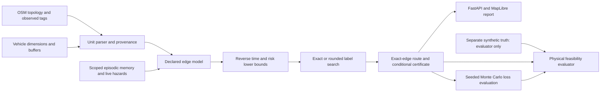

# RoadFit-X: research dossier and evidence audit

Validated locally on 2026-10-01. The authoritative experiment is in [experiments/reproducible/final](../experiments/reproducible/final/). This replaces earlier claims of an automatically complete Pareto frontier, unconditional polynomial complexity, and proven real-world safety.

## 1. Research question and current answer

How should a vehicle-aware router trade route availability, detour cost, and physical infeasibility when road limits are incompletely observed?

The implemented system can reproduce that trade-off on one OSM topology with seeded synthetic constraints. Conservative category priors avoid violations on the routes returned in this benchmark but cause substantial abstention. Exploratory priors increase availability and also expose hidden violations. A simpler hard-constraint baseline matches or exceeds the full router's physically feasible-query rate. The current evidence therefore supports an experimental prototype and correctness study, not a claim of superiority over established routing systems.

## 2. Related work and contribution boundaries

| Primary source | What it establishes | Consequence for RoadFit |
|---|---|---|
| Da Lu and Fatma Gzara, [Models and algorithms for the robust resource constrained shortest path problem](https://optimization-online.org/wp-content/uploads/2018/03/6519.pdf), 2018 preprint | Robust resource-constrained routing already has models, label search, and pruning methods. | Multi-label search and resource dominance alone are not a new contribution. Compare against published robust formulations and an optimization oracle. |
| Guo et al., [Efficient Stochastic Routing in Path-Centric Uncertain Road Networks—Extended Version](https://arxiv.org/abs/2407.06881), 2024 | Stochastic routing studies dependent path costs and tests on real trajectory datasets. | Independent edge simulations and search bounds are weaker evidence than dependence-aware evaluation on measured data. |
| Angelopoulos et al., [Conformal Risk Control](https://proceedings.iclr.cc/paper_files/paper/2024/hash/f3549ef9b5ff520a7e41ff3cc306ab2b-Abstract-Conference.html), ICLR 2024 | Calibration can control expected bounded monotone losses under stated statistical conditions. | A conformal component would need an actual calibration split and a route-selection-aware argument; an edge predictor is insufficient. |
| [Valhalla route API](https://valhalla.github.io/valhalla/api/route/api-reference/) | Truck costing includes physical vehicle parameters such as dimensions and weight. | The premise that all navigation ignores vehicle constraints is false. A competitive truck-routing baseline is required. |

These comparisons identify a research opportunity: **calibrated route abstention under spatially structured missing constraints**, with independent observation provenance and a measured availability-versus-violation trade-off. That opportunity is a proposal, not an established originality claim. [RESEARCH_DESIGN.md](RESEARCH_DESIGN.md) specifies the next architecture and falsifiable hypotheses.

## 3. Implemented architecture

The ordinary benchmark methods receive only the observed graph. The fully observed oracle is explicitly named and receives the truth graph. The generator stores no latent `truth_*` or underscore simulator attributes in routing inputs. Opposite directions of the same physical road share sampled geometry and missingness. All variants share OD pairs, latent realizations, nominal durations, and evaluation seeds.

`prepare_search` caches one graph/vehicle/configuration/weather/traffic condition. The graph must remain immutable afterward; mismatched configurations are rejected. Path reconstruction retains `(u, v, key)` so parallel edges cannot silently be exchanged for a faster blocked edge.

The brain subsystem is separate from the primary benchmark. SQLite episodes are scoped to vehicle dimensions and context, short-lived roadblocks expire after 15 minutes, and semantic consolidation fits a random forest from simulated experiences. It is not a real-fleet learning evaluation. The GNN file is untrained scaffolding and raises a dependency error rather than pretending to train successfully.

## 4. Physical model and missing-data policies

Observed positive finite width, height, and weight limits are parsed into metres and tonnes. Supported representations include feet/inches, metric length units, kilograms/pounds, and list or semicolon values. Ambiguous invalid tags remain unknown.

The required limits are vehicle width plus its width buffer, vehicle height plus its height buffer, and gross weight. Defaults include a 0.1 m width buffer and a 0.1 m height buffer. Negative margins are rejected; a small negative clearance is not treated as a safe squeeze.

| Policy | Missing width | Missing height | Missing weight |
|---|---|---|---|
| Strict | Reject absent/inferred limit | Reject absent/inferred limit | Reject absent/inferred limit |
| Conservative | Highway-category mean minus 1.645 standard deviations | 3.5 m engineering prior | 70% of category nominal limit |
| Exploratory | Highway-category mean | 4.5 m engineering prior | Category nominal limit |

The conservative width formula resembles a one-sided normal quantile but is **not a calibrated confidence bound**. Highway-category turning-radius thresholds are proxies; incoming-edge turn geometry, swept paths, articulated trailers, and dynamic obstacle clearance are not modeled. Where optional axle-load or grade tags exist, they add rejection checks. The held-out physical benchmark evaluates width, height, and weight only.

The probability model combines declared geometry and context with uncertainty and optional history. These scores have no measured frequency calibration. A memory penalty modifies the same edge model used by routing and simulation, and all routing alternatives receive the same reported roadblocks.

## 5. Algorithms and conditional proofs

Let the filtered graph be a finite directed multigraph. An accepted edge has positive time $t_e$, nonnegative uncertainty resource $u_e$, modeled survival $p_e$ in $(0,1]$, and clearance $c_e$. The label at node $v$ stores

$$L=(T,R,U,C),\quad T=\sum t_e,\quad U=\sum u_e,\quad C=\min c_e.$$

Time, risk, and uncertainty are minimized; clearance is maximized. Actual turn-dependent costs are absent, so node state is sufficient for this model. If those costs are introduced, state must include the incoming edge or another sufficient turn state.

### 5.1 Exact label search

Independent aggregation uses $R=\sum -\log p_e$. With budget $H$, a feasible modeled path obeys $R\le H$. A label dominates another at the same node when it is no worse in all four resources. Weak equality is also pruned to prevent duplicate labels.

**Dominance proposition.** For any common suffix, additive nonnegative resources preserve their ordering, and `min` preserves the ordering of bottleneck clearance. Replacing a dominated prefix therefore cannot worsen any objective or violate a risk budget previously satisfied by the dominated prefix. This proves that pruning is valid for the declared memoryless edge model. It does not prove that category priors describe actual roads.

**Search proposition.** Reverse Dijkstra computes lower bounds on remaining time and remaining risk in the filtered graph. Each can use a different minimizing parallel edge and still be a valid lower bound. Ordering labels by prefix time plus the reverse time bound makes the first accepted destination a minimum-time path within the declared feasible resource space. Risk lower bounds safely prune prefixes that cannot meet the modeled budget.

With `SearchConfig(exact=True)`, no candidate cap (`max_candidates_to_find=None`), and no interrupted expansion limit, the algorithm enumerates the nondominated objective vectors of accepted paths. Positive times mean a cycle is dominated by its cycle-free prefix, although the number of distinct labels can still be exponential. A finite candidate cap returns bounded candidates, not a complete frontier. `frontier_complete` and `status` expose this distinction. An exhausted expansion budget raises `RoutingSearchLimit`; it is never converted into proof that no route exists.

The default interface uses a finite expansion limit of 100,000. The interactive CVaR selector considers up to ten candidates and is therefore not a globally optimal stochastic routing solver.

### 5.2 Conservative resource rounding

For step sizes $\delta_R,\delta_U,\delta_C>0$, round each edge risk and uncertainty upward to integer ticks and clearance downward:

$$\widehat r_e=\delta_R\lceil r_e/\delta_R\rceil,\quad
\widehat u_e=\delta_U\lceil u_e/\delta_U\rceil,\quad
\widehat c_e=\delta_C\lfloor c_e/\delta_C\rfloor.$$

**Feasibility proposition.** For a path with $m$ edges,

$$R\le\widehat R<R+m\delta_R,\quad U\le\widehat U<U+m\delta_U,\quad C-\delta_C<\widehat C\le C.$$

Consequently, acceptance under $\widehat R\le H$ conservatively satisfies the unrounded modeled budget. Quantized dominance is valid within the rounded resource space. Rounding can reject an originally feasible path or discard an original-objective nondominated path. The implementation makes no unconditional FPTAS, polynomial-time, or exact-original-frontier claim. Its default steps are 0.0005 risk units, 10 uncertainty units, and 0.1 m clearance.

### 5.3 Dependence-robust union aggregation

Use $q_e=1-p_e$ and risk resource $R=\sum q_e$. Convert the existing hazard budget to $B=1-\exp(-H)$ to keep the same nominal route-risk target.

**Conditional route guarantee.** If each $q_e$ is a valid upper bound on the edge failure probability for this vehicle and context, then

$$\Pr(\text{any route failure})\le\sum_{e\in P}q_e\le B$$

by the union bound, without assuming independence between edge failures. Conservative rounding preserves this inequality. Independent aggregation instead requires the declared edge independence assumption to interpret the product as route survival.

Neither guarantee becomes an empirical safety guarantee when fed uncalibrated scores. Simultaneous calibration, adaptive route selection, distribution shifts, and map provenance remain unsolved in the current implementation. Tests verify the numerical budget certificate and rejection behavior, not the missing statistical premise. The union bound itself is established mathematics; its inclusion is a useful implementation improvement, not an invention claim.

### 5.4 Tail-loss simulation

The simulator uses 1,000 seeded scenarios, a shared lognormal traffic multiplier, edge-key-seeded Bernoulli draws, and a 14,400-second failure penalty. Shared route edges receive common random numbers across candidate comparisons. Failures have a Boolean flag and are not inferred from whether elapsed time exceeds the penalty. Reported ETA quantiles describe nominal traversal duration under the traffic multiplier; they are not completion-time guarantees.

Empirical CVaR averages the worst $(1-\tau)$ mass, including a fractional boundary sample when needed. Selection minimizes simulated CVaR among the available candidates. Both the probability model and loss penalty are uncalibrated engineering assumptions; tail-loss improvements must not be presented as observed incident reductions.

## 6. Experiment protocol

- Graph: supplied Koramangala/Bengaluru OSM drive topology, 3,852 nodes and 9,856 directed edges. The input graph SHA-256 is recorded in the manifest.
- Vehicle: delivery van, width 2.4 m, height 2.8 m, gross weight 5 t, and 0.1 m width/height buffers. Context: clear weather and normal traffic; moderate risk budget $H=0.22$.
- OD sample: 100 unique pairs from the largest strongly connected component, seed 104729. Stratification targets 40 arterial-to-residential, 40 residential-to-residential, and 20 arterial-to-arterial pairs; residential pairs use a 1.5 km separation condition where supported by the graph.
- Synthetic realizations: seeds 41, 42, 43. Per-road width is sampled from highway-category priors; height and weight are also synthetic. Missing-width rates are 0%, 30%, and 60%. The same latent dimensions and mask uniforms are reused across missingness conditions.
- Missingness hides width only. Height and weight remain available to isolate lateral-information loss. This is random masking, not validated real-world missing-not-at-random behavior.
- Methods: two observed-input baselines, eleven RoadFit configurations, and one fully observed synthetic oracle; 14 variants total.
- Evaluation: physical constraints from a separate truth graph, 1,000 Monte Carlo scenarios, paired OD comparisons, and descriptive 95% bootstrap intervals clustered by OD pair. There are 300 queries per method/missingness condition, but only 100 fixed OD clusters on one city topology.
- Runtime: three CPU experiment workers. Per-query time excludes condition preparation and Monte Carlo evaluation; `Preparation_ms` records model preparation separately. Reverse shortest-path bounds are query-specific and included. Concurrent timings are descriptive and depend on this machine.

The final run completed 12,600 records in 98.6 seconds. The earlier environment and fresh environment reproduce every non-timing CSV field and all paired bootstrap statistics exactly. The verifier checks the current source and input graph hashes. Timings and manifest source hashes differ between earlier snapshots; they have not been rewritten to conceal changes.

## 7. Metrics and denominators

| Metric | Definition and evidence basis |
|---|---|
| Returned rate | Returned routes divided by all queries; absence or a search limit is not success. |
| Conditional physical failure | Returned routes with any width/height/weight violation divided by returned routes. Undefined if none are returned. |
| SafeSuccess | Returned and physically feasible queries divided by all queries, using synthetic truth in this experiment. This is not a real-world safety certification. |
| ISER | Length fraction with at least one known width/height/weight violation. Unknown observations cannot establish feasibility. |
| CNME | Length fraction whose available width clearance is between 0 and 0.2 m. |
| Constraint coverage | Length fraction with finite width, height, and weight observations in the evaluator input. |
| MDEF | Length fraction lacking an observed width in the router input. This remains based on the observed graph even when truth is available to evaluation. |
| ETTP | Percentage increase in nominal time relative to B0 for the same query/context. Means condition on a returned route; paired time comparisons require both methods to return. |
| TRR | Simulated CVaR divided by nominal route time. It is dimensionless and depends heavily on the failure penalty. |
| Minimum clearance | Minimum evaluator-input width minus width and buffer. Null if any route width is unknown. |

No-route metrics are null. The live dashboard only reports constraints from available observations. A zero known-violation rate with incomplete coverage is not evidence that hidden edges are feasible. Benchmark metrics using synthetic truth are explicitly labelled `held_out_synthetic_truth`.

## 8. Measured results

At 30% missing width, each row has 300 queries:

| Variant | Returned | Returned rate | Conditional violations | Physically feasible-query rate | Mean ETTP on returned routes |
|---|---:|---:|---:|---:|---:|
| B0 ETA | 300 | 100.0% | 66.0% | 34.0% | 0.00% |
| B1 Hard constraints | 119 | 39.7% | 0.0% | 39.7% | 14.93% |
| RF Exact | 116 | 38.7% | 0.0% | 38.7% | 17.46% |
| RF Rounded | 116 | 38.7% | 0.0% | 38.7% | 17.51% |
| RF Union bound | 116 | 38.7% | 0.0% | 38.7% | 17.51% |
| RF Union rounded | 114 | 38.0% | 0.0% | 38.0% | 17.47% |
| RF Strict | 4 | 1.3% | 0.0% | 1.3% | 263.80% |
| RF Exploratory | 261 | 87.0% | 36.8% | 55.0% | 8.05% |
| RF -geometry | 300 | 100.0% | 66.0% | 34.0% | 0.00% |
| RF -hazard | 119 | 39.7% | 0.0% | 39.7% | 14.93% |
| RF -uncertainty | 116 | 38.7% | 0.0% | 38.7% | 17.45% |
| RF -clearance | 116 | 38.7% | 0.0% | 38.7% | 17.46% |
| RF -reverse bounds | 116 | 38.7% | 0.0% | 38.7% | 17.46% |
| Oracle Hard constraints | 255 | 85.0% | 0.0% | 85.0% | 10.89% |

The strict ETTP estimate comes from only four returned routes and should not be generalized. Oracle knowledge is privileged and is not available to ordinary algorithms.

| Missing widths | Conservative exact return / feasible-query rate | Exploratory return rate | Exploratory conditional violations | Exploratory feasible-query rate |
|---|---:|---:|---:|---:|
| 0% | 82.7% | 82.7% | 0.0% | 82.7% |
| 30% | 38.7% | 87.0% | 36.8% | 55.0% |
| 60% | 24.0% | 91.0% | 49.1% | 46.3% |

### Negative and null findings

1. **Physical filtering matters.** Removing geometry reproduces B0's 66% conditional violations at every missingness level in this synthetic setting.
2. **The full method does not dominate B1.** At 30% missingness, B1 returns three more physically feasible routes and has a lower conditional mean time penalty. Removing the hazard budget also produces B1's availability. The present risk model does not demonstrate an observed physical-safety benefit beyond filtering.
3. **Rounding costs availability.** At complete synthetic observation, exact returns 248/300, rounded 245/300, and union-rounded 236/300. At 60% missingness, these are 72, 71, and 70. No acceleration claim follows just from adding quantization.
4. **The clearance ablation is null for the selected route.** Its outputs match exact on this benchmark. The interface selects minimum time subject to risk, so clearance is a label objective rather than a separately enforced preference. It should not be claimed to improve these selected routes.
5. **Uncertainty changes some choices but not availability here.** Equal feasible-query rates do not establish usefulness of a learned uncertainty component; none was trained.
6. **Reverse bounds help search.** With complete observations, removing them produces 12 expansion-limit events and returns 239 routes versus 248 with bounds. Final-run median query time is approximately 120.9 ms without bounds versus 9.9 ms with them. This comparison includes no-path queries and concurrent execution; it is not a general scalability result. The bounds are established techniques.
7. **Higher exploratory availability is not uniformly better.** At 60% missingness, almost half its returned routes violate held-out synthetic limits. Conversely, increased feasible-query rate at 30% missingness shows why abstention must be reported alongside conditional violations.

For 30% missingness, the descriptive paired OD-cluster interval for B1 minus RF Exact in feasible-query rate is +1.0 percentage point, interval [0.0, 2.33]. B0 minus RF Exact is -4.67 points, interval [-11.33, 1.67]. Exploratory minus RF Exact is +16.33 points, interval [10.67, 22.0]. These intervals describe this fixed topology and synthetic draws. Overlapping road use, multiple comparisons, and only one city prevent a population-level significance claim.

## 9. Correctness and application validation

The 77-test suite includes an exhaustive simple-edge-path oracle on 20 random cyclic five-node multigraphs. It compares complete exact-search objective vectors against independently enumerated paths. This exercises algorithmic dominance and path reconstruction; it shares the declared edge model and cannot validate that model against reality.

Regression checks cover imperial-unit parsing, invalid finite values, strict/conservative/exploratory separation, negative clearance smaller than 0.1 m, exact parallel-edge handling, a near-budget competing-prefix case, rounded independent/union certificates, capped frontiers, expansion limits, immutable-condition mismatch, sequestered synthetic truth, null no-route metrics, height/weight violations, fractional CVaR, and real failure flags.

API tests exercise both map-coverage paths, input validation, reported hazards across routing alternatives, geometry orientation, actual simulated quantiles, background-job failure reporting, and selected-vehicle memory scope. A separate CPU smoke run actually creates SQLite episodes and fits a model rather than merely asserting job scheduling.

The frontend passes a clean install, Oxlint, and a production build. MapLibre v6's bundler worker is explicitly served through Vite; [the official migration guide](https://maplibre.org/maplibre-gl-js/docs/guides/v5-to-v6-migration-guide/) explains why automatic worker URL detection does not work reliably with bundlers. Browser verification and captured evidence are in [VERIFICATION.md](../experiments/verification/VERIFICATION.md). The build retains a large-map-library chunk warning; the test client emits one dependency deprecation warning.

## 10. Limits on publication and deployment claims

All dimensions are synthetic and deliberately generated from related category priors; conservative-policy performance may be optimistic because simulator and model share assumptions. Random width masking is weaker than real spatially correlated or safety-related missingness. One city and one benchmark vehicle cannot establish geographic or vehicle generalization. No observed accident labels, probability calibration, learned-model comparison, actual turn feasibility, or live fleet validation is available.

The code establishes conditional numerical routing properties. It does not establish a novel theorem beyond standard label-search and union-bound arguments. A new acronym or adding an untrained GNN would not change that.

For an A*-level paper, the primary claim should be narrowed to a validated contribution in missing-data calibration and route abstention, supported by real observations, stronger baselines, scaling, and cross-city tests. The domain fit of a spatial conference is separate from its current ranking. As of this audit, [SIGSPATIAL 2026's official research call](https://sigspatial2026.sigspatial.org/research-submission.html) lists a June 5, 2026 deadline, already past; it also requires disclosure of AI-assisted material. Choose the next open call and verify its actual ranking and submission rules before preparing venue formatting. No paper has been submitted or acceptance represented as guaranteed.
