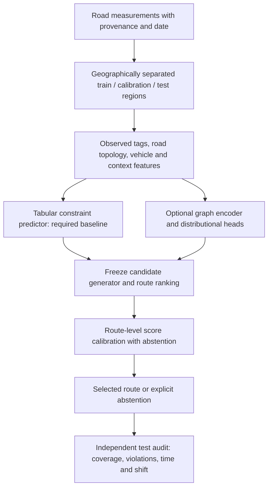

# A defensible next contribution: route-level calibration with abstention

**Historical proposal.** The current implemented direction and completed experiments are documented in [ANTICIPATORY_RESEARCH.md](ANTICIPATORY_RESEARCH.md), with an internal manuscript in `research/roadfit_paper.tex`. That work expands the map, implements anticipatory vehicle-aware routing and officer control, and evaluates recorded ETA prediction. The calibration extension below remains a proposal; the original readiness table describes the earlier constraint study, not the current project inventory.

This is a proposed research extension, **not a trained model, executed field study, or verified novelty claim**. The implemented exact/rounded/union search and the measured synthetic ablations are documented in [PROJECT_DEEP_DIVE.md](PROJECT_DEEP_DIVE.md). They provide a working foundation; they do not establish an A* contribution by themselves.

## Why the current method needs a different claim

At 30% missing widths, the hard baseline returns 119 physically feasible synthetic routes, while the full exact router returns 116. Exploratory routing raises the feasible-query count to 165 but returns 96 violating routes as well. This makes **how to abstain reliably while preserving useful coverage** a stronger question than “does adding a GNN improve navigation?”

The research claim to test is: calibrated selection of vehicle-feasible routes can increase useful route coverage at a declared violation-loss target under spatially structured missing observations. Success requires measured constraints, held-out cities or regions, and competitive baselines. If simple calibrated tabular models match a graph encoder, the graph encoder should be removed from the central contribution.

Established work already covers [robust resource-constrained shortest paths](https://optimization-online.org/wp-content/uploads/2018/03/6519.pdf), [dependent stochastic routing](https://arxiv.org/abs/2407.06881), and [conformal risk control](https://proceedings.iclr.cc/paper_files/paper/2024/hash/f3549ef9b5ff520a7e41ff3cc306ab2b-Abstract-Conference.html). A focused literature search must test whether this particular missing-observation and adaptive-routing problem has already been solved. Absence from the few sources reviewed here is not evidence of nonexistence.

## Architecture to evaluate

Inputs must distinguish measurement, imputation, and missingness. Predict distributions over width, height, and weight limits rather than a single arbitrary success score. Separate road IDs and spatial blocks across splits so the opposite direction of a road or a nearby duplicate does not leak into evaluation. Freeze feature normalization and predictors before calibration. Store missingness indicators instead of exposing held-out dimensions to the router.

An optional graph model can aggregate road-neighborhood features into distributional constraint heads. It should share vehicle conditioning with the tabular model and expose calibrated uncertainty. Actual turn feasibility requires an edge-transition graph with swept-path or measured turn constraints; adding attention layers does not solve that geometry problem. None of these learned or turn-aware extensions is implemented in this audit.

## Proposed calibration algorithm and its statistical boundary

An adaptive search over many uncertain edges complicates an edge-level calibration argument. Calibrating individual predictions marginally does not automatically control the risk of a route selected after inspecting those predictions.

Start with a simpler, falsifiable route-level procedure:

1. Train the constraint predictor without the calibration or test regions.
2. Freeze candidate generation, route ranking, and the selected route for each query independently of calibration labels. Candidate selection can use the implemented resource-constrained search.
3. Define a scalar predicted route-risk score `S` and measured route violation label `Y`. Width/height/weight labels require independent road observations; unknown truth is excluded from certified evaluation and reported as missing.
4. Accept a frozen selected route only if `S <= threshold`; otherwise abstain. A threshold affects acceptance, not the identity of the selected route.
5. On calibration queries use bounded loss `L_threshold = Y * accepted`. With the fixed candidate policy this loss is monotone in the threshold. Apply an appropriate finite-sample calibration rule under explicitly justified exchangeability assumptions.
6. Freeze the threshold before evaluating coverage and violation loss on held-out test regions. Separately test shifts in vehicle class, city, context, and missingness pattern.

This construction targets **expected violating-return loss over all queries**, which can become small simply through abstention. It does not by itself bound the conditional violation rate among returned routes. Report both denominators and seek the greatest supported coverage at the declared loss target. Claiming conditional risk control requires a separate valid statistical method and proof.

If the algorithm reroutes when the threshold changes, monotonicity must be re-established; it cannot be assumed. Spatially overlapping queries are also not independent calibration examples. Use measured region-level clusters, characterize exchangeability, and disclose when only an empirical calibration study is justified.

The implemented union-bound certificate solves a different problem: it controls a declared route bound **if valid marginal edge bounds are supplied**. Conformal expected-loss control does not automatically supply simultaneous pointwise edge bounds. Keep these two guarantees distinct in the manuscript.

## Experiments required before the claim is credible

The following is a research protocol, not a list of completed runs:

| Question | Required comparison | Evidence to report |
|---|---|---|
| Does it beat ordinary truck routing? | Valhalla truck costing with matched dimensions, a vehicle-filtered shortest path, the current priors, and published robust routing | Equal map input, matched physical limits, query-level paired results, abstention and violation denominators |
| Is learning necessary? | Category prior, linear/tabular model, random forest or boosting, graph encoder | Equal splits and inputs; predictive error, calibration, route coverage and violation loss |
| Is route calibration necessary? | No calibration, edge calibration only, frozen route calibration | Held-out loss at declared targets, coverage, confidence intervals that respect spatial clusters |
| Does dependence matter? | Independent edge aggregation, union bounds, region-correlated failures or constraints | Equal risk targets, coverage loss, empirical violation loss and assumption violations |
| Does incomplete observation change conclusions? | Random masks, missingness by road category, connected spatial holes, masking associated with narrow roads | Same latent truth, multiple seeds, observed coverage, shift behavior |
| Does it generalize? | Geographically separated regions/cities and several vehicle classes | Per-domain results and pooled results, calibration transfer, failures under shift |
| Does it scale? | Increasing graph and query size; exact, rounded, and published pruning/optimization baselines | Preparation cost, routing latency, labels expanded, peak memory, interrupted searches, approximation losses |
| Is a frontier or CVaR selector useful? | Fastest certified route, explicit clearance preference, bounded candidates, exhaustive small-instance oracle | Candidate truncation, route changes, actual objective gains and simulator sensitivity |

Use at least several distinct urban topologies and vehicle classes; choose sample sizes from an explicit power/precision analysis once measured-label variability is known. Reserve entirely independent test regions. Sweep risk budgets and rounding steps. Report all model-selection attempts and null ablations. A complete frontier comparison belongs on tractable instances or must expose computational limits.

Use GPU 0 only for a justified learned-model experiment after labels and splits exist. The detected RTX 5060 Laptop GPU has about 8 GB VRAM, so a modest graph model with neighborhood batching and mixed precision is a plausible local experiment. Record the CUDA/PyTorch versions, peak allocated memory, seeds, checkpoints, and preprocessing hashes. The current graph-search benchmark is CPU-based and has no GPU training claim.

## Submission gates

| Gate | Current status |
|---|---|
| Executable application and reproducible synthetic evaluation | Completed locally; tests, artifacts, manifests, figures and browser evidence available |
| Correctness argument for declared search model | Written conditional propositions and exhaustive small-graph tests available |
| Competitive baseline superiority | Not established; the hard baseline wins some comparisons |
| Verified originality | Not established; reviewed core techniques are existing methods |
| Measured multi-city constraints and vehicle outcomes | Missing |
| Trained/calibrated learned model with independent test audit | Missing |
| Strong scalability and approximation study | Missing; current study is one small city subgraph |
| Venue-specific manuscript, disclosure, reproducibility and submission | Not prepared or submitted |

Choose a venue around the eventual demonstrated contribution. KDD is a potential data-mining target only if the calibrated learning/data contribution warrants it; spatial/database venues may fit the routing and benchmark emphasis better. Check the current ranking and next open call rather than treating domain fit as an A* designation. Keep synthetic evidence labelled synthetic, include the negative findings, and disclose AI assistance according to the selected venue's rules.
